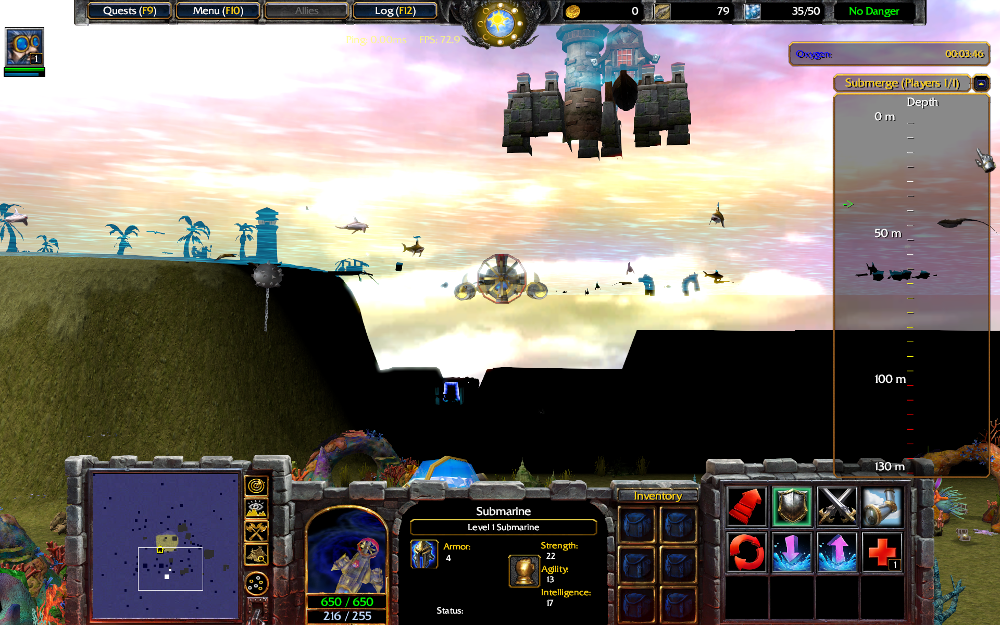
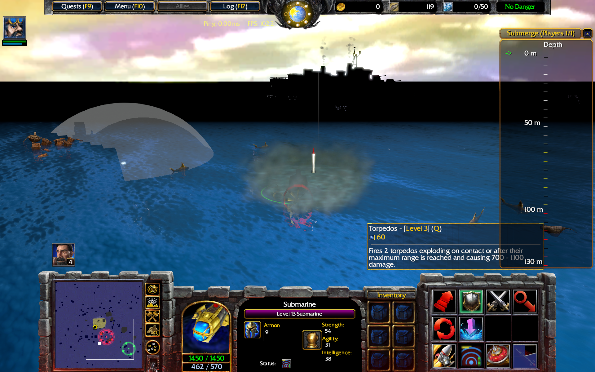

# Submarine Warfare

Warcraft III Reforged funmap in which you control your submarine and have to destroy the other submarines.

## Play the Map

* [submarinewarfare0.3.w3x](./submarinewarfare0.3.w3x)
* [Download on HiveWorkshop](https://www.hiveworkshop.com/threads/submarine-warfare-0-2.332475/)
* [Discord Server](https://discord.gg/sXUWS9w9JE)

## Gameplay

* Destroy the enemy underwater base to win the game.
* Kill fishes to gain XP and gold.
* Buy items from gold to upgrade your submarine.
* Repair destroyed allied submarines by moving to their location.
* Do not get destroyed.
* Destroyed submarines will be revived automatically after some time.
* Submerge with your submarine to explore the ocean and find useful items.
* Do not stay under water for too long or too deep or your submarine will get destroyed.

### Movement

You control your submarine using arrow keys.

### Camera Control

Press F2 to select the hero icon for the camera control which allows you to to move the camera around your submarine.

### Submerge

As long as your submarine is not submerged you cannot see submerged submarines or what is going on under water.
You are an easy target for enemy players, ships and weather conditions.
However, you heal and regenerate your mana faster staying on the water surface and you move much faster.

The submarine can submerge which makes it invisible from nun-submerged units and allows you to see whats going on under water but slows it down and reduces its life and mana regeneration.
There is also a time limit on how long you can submerge with oxygen.
You can dive deeper into the water with the submarine which allows you to discover the seabed and collect useful items.
However, the pressure gets higher when you dive deeper and it might break your submarine after some time, so do not stay there forever.
Besides, the view gets worse if you dive deeper into the water.

### Torpedos

Your submarine can fire torpedos which do not auto target by default. However, there is an item which allows you to mark targets and then the torpedos will always follow it.
There is a time limit how long torpedos stay alive, so the target can avoid them by moving away long enough.

### Water Mines

Water mines can be placed anywhere in the water and stay invisible except for submerged submarines. They explode on moving over them causing massive damage.

### Water Bombs

Water bombs can be dropped anywhere in the water and explode after a short delay causing massive damage to units.

### Fishes

Fishes can easily be killed and give you XP and gold. They respawn all the time. The lumber icon and number of Warcraft are used to show the total number of fishes on the map.
Fishes will be killed when the submarine moves throught them and is at the same depth as they are.
Fishes which are deeper in the water will give more XP and gold.

### Destroyers and Air Craft Carriers

There are hostile ships on the map shooting at you and placing water mines. You can avoid them by submerging or kill them to gain more XP and gold than by killing fishes.

### Storms

Storms start randomly and create waves and lightning bolds on the water surface causing damage to units which are not submerged.

### The Island

There is an island in the middle of the map where you can leave your submarine and walk around to buy items and do things.
Use your crystals there to upgrade the submarine.

### Crystals

Crystals are useful artifacts collected from the seabed. You need to dive to the deepest level to get them, so be careful to get not too greedy.
They can be used to upgrade your submarine.

## Screenshots

|               |               |
| ------------- | ------------- |
|              |  |
|              |

## Old Versions

* [submarinewarfare0.2.w3x](./old/submarinewarfare0.2.w3x)
* [submarinewarfare0.1.w3x](./old/submarinewarfare0.1.w3x)

## Credits

* 01 - Hymn To Red October (Main Title).mp3 - Basil Poledouris, The Hunt For Red October
* 02 - Das Boot.mp3 - Klaus Doldinger, Die Original Filmmusik Das Boot
* Gnomish Submarine - Kam, Xaran Alamas, Dmitry Rommel, Tufy
* Shark models - olofmoleman
* HammerheadTorpedos -  MiniMage
* SystemCom icon - Captain_Rufar
* BTNGnomeEngineer - Scias
* BTNCRNuclearP - CRAZYRUSSIAN
* BTNLaptop - Zombie
* Destroyer - Illidan(Evil)X
* WaterMine model - Teaspoon
* Flashlight Omni - Grey Knight
* BTNGaussRifle1 - The_Silent
* Gnome Engineer - Pvt.Toma
* Gnome Brassman - Pvt.Toma
* Murray in Rock-Cave - Uncle Fester
* Light House model - GrimShaman
* HQ Treasure Chest - HammerFist132
* BTNMotor - The_Silent
* Coral Tree - waveseeker
* Translated LUA Camera Offset System - kovadarra
* Loading Screen - https://img.8wallpapers.com/uploads/2019/12/0daf4e9c0e2f42baa7c6bb19.jpg
* BTNFishDish - darkdeathknight
* BTN3HookGRAY - PrinceOfFame
* Dolphin - olofmoleman
* Fish Vending Stand - Sunchips
* Fillet Knife - Sunchips
* Salmon - Sunchips
* OinkerCyl8 - MeteORA
* Wooden Fishing Rod - MeteORA
* FishingBobber - karland90
* BTNFishing1 - KelThuzad
* BTNDamagedKnife - HammerFist132
* Stingray (variation 1) - Kuhneghetz
* Stingray (variation 2) - Kuhneghetz
* BTNStingray01 - Kuhneghetz
* BTNStingray02 - Kuhneghetz
* BTNSkyRockets - Narandza
* BTNearth - AlienArsonist
* BTNMotorBoost - The_Silent
* Sunken Ship with Treasure - Uncle Fester
* Console - Fingolfin
* Console - Fingolfin
* PoA Navigation Depot - Fingolfin 
* Space Radiator - Fingolfin
* Autumn Wall Section - Fingolfin
* Modern Plasma Screen - chilla_killa
* CannonNaval - Mechanical Man
* Modern Barrel [4 Variants] - The_Silent
* Gate (Demon) and Derivatives - Ujimasa Hojo 
* Force Shield(Team colour) - ApeJI
* Mermaid model - Hexus, http://wc3-maps.ru/load/modeli_dlja_warcraft_3/modeli_nagov_dlja_wc3/ehnniehlla/55-1-0-18874
* Fish - MiniMage
* Dead Fish - MiniMage
* Nautilus - Uncle Fester
* Piranha - Misha
* Sheltered Raft - The_Silent
* Lava (used as water), HappyTauren https://www.hiveworkshop.com/threads/lava.222317/
* Muti-Tier Hydra - frostwhisper
* BTNTarget - ChirusHighwind
* SnipingTarget - ChirusHighwind
* OinkerGeosphere2 - armel
* Orange & Purple Crystals - Uncle Fester
* Blue & Green Crystals - Uncle Fester
* Red & Yellow Crystals - Uncle Fester
* Su-35 Super Flanker - Su-35 Super Flanker
* NuclearExplosion - WILL THE ALMIGHTY
* Aircraft Carrier - Illidan(Evil)X
* BTNDestroyer - Null
* BTNMetalPlatingLevel1, BTNMetalPlatingLevel2, BTNMetalPlatingLevel3 - The_Silent
* Cannoneer Team Kul-Tiras HD/Age of Colonization - Asssssvi
* RocketMissile-2- - Kofi_Banan
* BTNrocket - Zombie
* BTNBubbles - Golden-Drake
* Elevator model - bisnar13
* Whirlpool - Mc !
* U-Boat - Illidan(Evil)X
* BTNSimpleCompass12 - Solu9
* BTNGoldIngot - Kenathorn
* Gold Ingot - Kenathorn
* Gatling Canon - Shardeth
* BTNTurret - ikillforeyou
* Gnome Castle - Pvt.Toma
* Gnome Turret - Pvt.Toma
* Guardian (Variations) - Mister_Haudrauf
* Red Laser - Champara Bros
* BTNPieceOfShip - NFWar
* BTNCamera - darkdeathknight
* BTNCameraFar - darkdeathknight
* BTNCameraClose - darkdeathknight
* BTNINV_Misc_Bomb_01 - Blizzard Entertainment
* BTNINV_Misc_Bomb_02 - Blizzard Entertainment
* BTNRocketFlare - 4eNNightmare
* BOMB! - Kitabatake
* Ironclad Submarine - Kam, Sellenisko, infrenus
* BTNCameraReset - darkdeathknight
* Ceiling Rays - Tranquil
* AnimatedEnviromentalEffectRainCv002 - kellym0
* Dunkleosteus - olofmoleman
* BTNDunkleos - olofmoleman
* Dreadnought Ships - purparisien
* Imperial Russian Cruiser Bogatyr - ingolfin